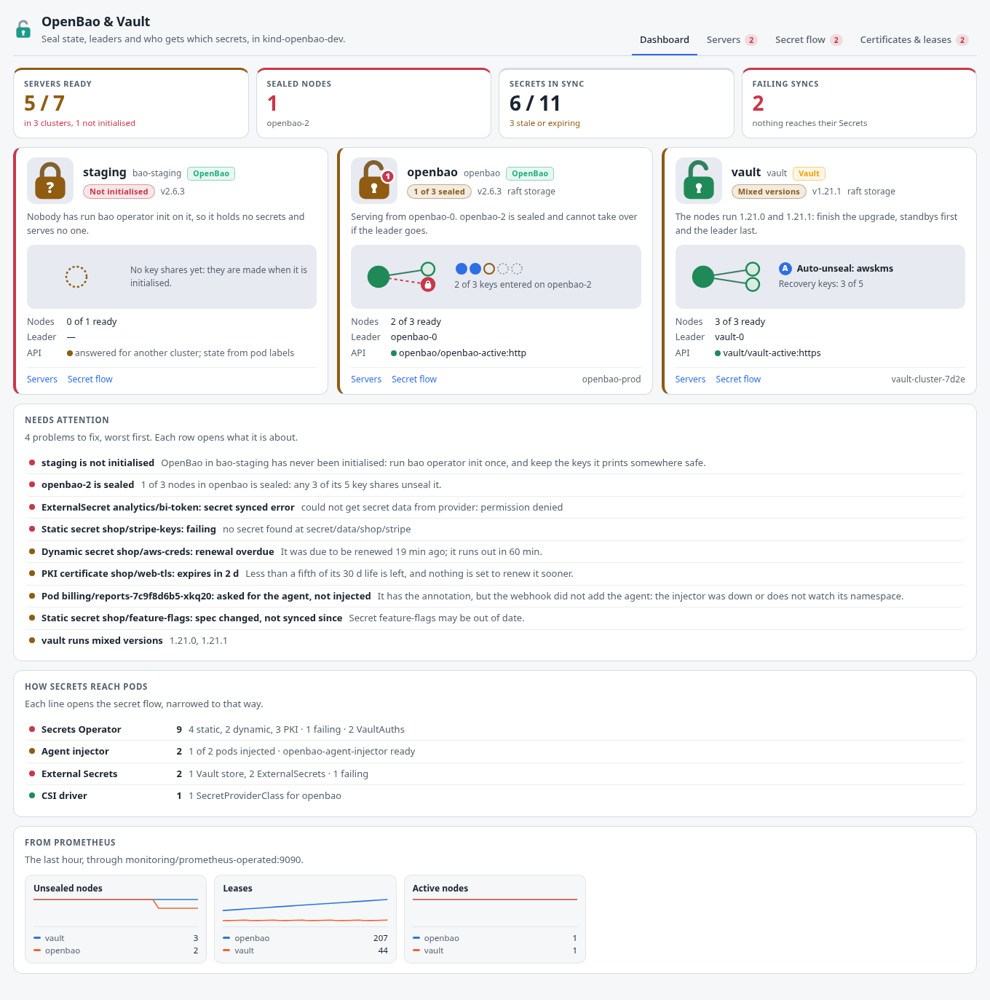
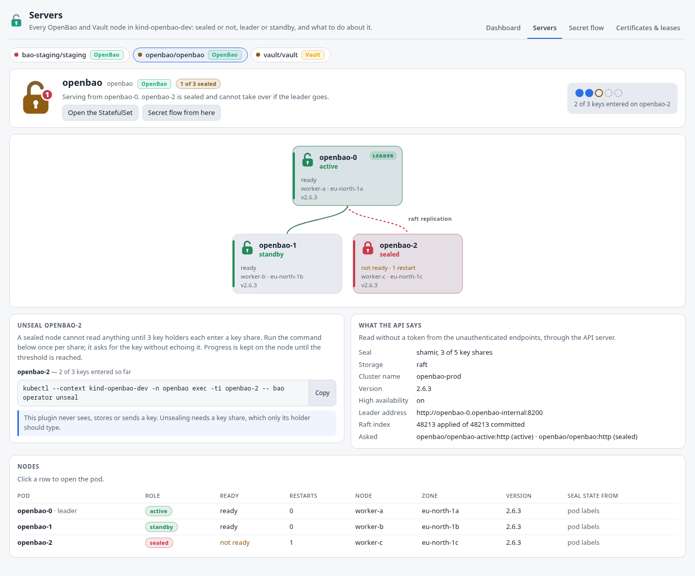
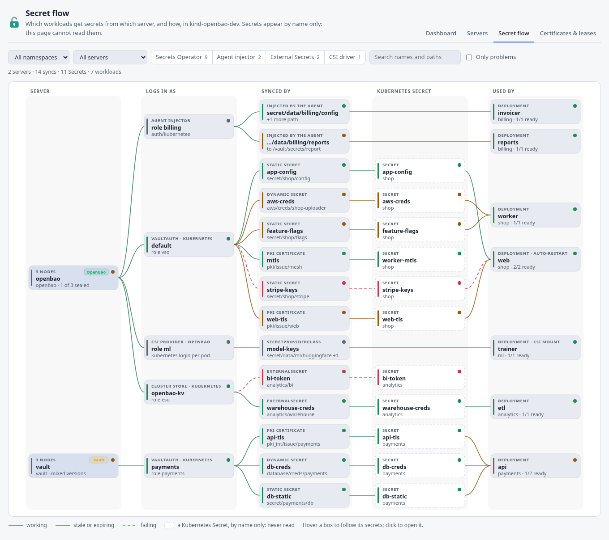
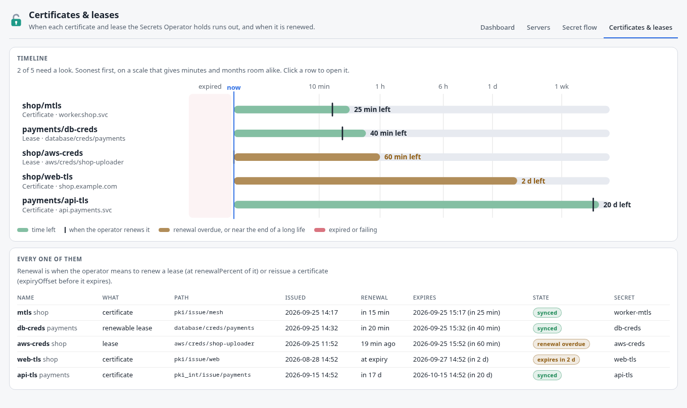

# OpenBao & Vault for K8s Dockside

A [K8s Dockside](https://github.com/k8sdockside/k8sdockside) plugin for
[OpenBao](https://openbao.org) and [HashiCorp Vault](https://www.vaultproject.io),
the secret stores that keep everything behind a seal: a server that restarts
comes back sealed and serves nothing until enough key holders unseal it, and
an HA cluster serves from one leader with standbys waiting to take over.
OpenBao is the open-source fork of Vault — one API, one deployment shape — so
the plugin tells the two apart on its own and shows both the same way.

It answers the questions you open it for — can anything read a secret right
now, which node is leading, which one is sealed and what do I type to fix it,
and which workloads get which secrets from where — without `bao status`,
without a token, and without ever reading a secret.

<!-- markdownlint-disable-next-line MD033 -->




## What it shows

**Dashboard** — one card per server cluster, with a padlock you can read from
across the room: open and green when every node is unsealed, open and amber
with a red badge counting the sealed nodes when it still serves from its
leader, shut and red when nothing is unsealed, a question mark when nobody has
initialised it. Under it, the seal's key shares as slots — the threshold ringed
and, on a sealed node, the shares entered so far filled in ("2 of 3 keys
entered on openbao-2"), or the KMS for an auto-unseal — and the cluster's
shape: the leader as a filled circle, standbys as green rings, a sealed node
red with a lock in it. Each card names the product (OpenBao or Vault), its
version and storage, the leader, and the Service its API answered through.
Tiles count servers ready, sealed nodes, secrets in sync and failing syncs.

Then everything that needs a person, worst first, each row opening what it is
about: a server nobody has initialised, a sealed node, a cluster with no
leader, a pod not running, failing and stale Secrets Operator syncs with the
operator's own error, an invalid VaultAuth, failing External Secrets, an agent
injector that is down, pods that asked for the agent and did not get it,
leases overdue for renewal, certificates near the end of a long life, and
nodes running different versions. Then a line per way secrets reach pods, and
the servers' own metrics from Prometheus when there is one.

**Servers** — one cluster, whole: the leader on top and the other nodes
under it as cards, each with its padlock, its role, readiness and restarts,
node and zone, and version (an old one in amber during an upgrade). Next to it,
what to do, in plain words and with a command to copy:

- a sealed node: `kubectl … exec -ti openbao-2 -- bao operator unseal`, once
  per key share (it asks for the key without echoing it) — `vault operator
  unseal` on Vault; for an auto-unseal, where to look instead;
- a server nobody has initialised: `bao operator init`, and to keep the keys it
  prints somewhere safe;
- a cluster with mixed versions: which pods to delete, standbys first, since
  the charts roll their StatefulSet with `OnDelete`.

The plugin never sees, stores or sends a key: it only shows where one is
typed. Beside that, what the API says — seal type and threshold, storage,
cluster name, HA and the leader's address, raft indexes — and every node as a
table.



**Secret flow** — who gets what, as a graph read left to right: the server →
how the client logs in (a VaultAuth's method and role, an External Secrets
store, the agent injector's role, a CSI class's role) → what fetches the
secret (a VaultStaticSecret, VaultDynamicSecret or VaultPKISecret with its
mount and path, an ExternalSecret, a SecretProviderClass, or the agent with
the paths it renders) → the Kubernetes Secret it lands in, by name only → the
workloads whose pods use it (through `env`, `envFrom` or a volume), including
the rollout-restart targets. Lines are green when working, amber when stale or
expiring, dashed red when failing. Filter by namespace, by server, by the way
secrets arrive, by problems only, or search; hovering a box lights its chains
and clicking opens it.



**Certificates & leases** — every VaultPKISecret and VaultDynamicSecret by how
long it has left, soonest first, on a scale that gives ten minutes and a month
room alike, with a tick where the operator means to renew it and amber for a
renewal that is overdue or a long-lived certificate in its last fifth. A table
under it has the dates.



**Panels** on every Pod — on a server pod, its padlock, role, version and
what it means ("openbao-2 is sealed: it serves nothing until 3 key shares are
entered on it"); on any other pod, what it gets from OpenBao or Vault and how
(a Secret the Secrets Operator or External Secrets keeps, a CSI mount, or the
agent's paths), and from which server — and on VaultStaticSecrets,
VaultDynamicSecrets and VaultPKISecrets: the chain as a strip, the state with
the operator's own words, when it last synced and when it runs out, and **Sync
now**.

The sidebar also gets tables of the server pods, the Secrets Operator's kinds
and the agent injectors, and three count cards.

More screenshots, in both themes, are in [`docs/screenshots/`](docs/screenshots/).

## What it reads

- **Pods**, all of them: server pods are recognised by the labels service
  registration writes (below), or by the charts' `component=server` with an
  OpenBao or Vault image; every other pod is read for the Secrets its spec
  names, the SecretProviderClasses it mounts, and the injector annotations.
- **StatefulSets** (how many replicas a cluster wants), **Deployments** (the
  agent injector and the Secrets Operator), **Nodes** (their zone) and
  **MutatingWebhookConfigurations** (which one feeds the injector).
- The **Vault Secrets Operator**'s kinds in `secrets.hashicorp.com/v1beta1`:
  VaultConnection, VaultAuth, VaultAuthGlobal, VaultStaticSecret,
  VaultDynamicSecret and VaultPKISecret.
- Optionally, **External Secrets**' SecretStore, ClusterSecretStore and
  ExternalSecret (only stores with `provider.vault`), and the **Secrets Store
  CSI** driver's SecretProviderClass (only `provider: vault` or `openbao`).

It **never reads Secrets** — the app refuses that to every plugin page,
whatever a manifest says — and needs none: a Kubernetes Secret appears only
as the name something points at. It holds **no token** and asks the servers
nothing that needs one.

### The servers' own API

Through the API server's service proxy (the `services/proxy` permission; the
built-in `edit` and `admin` roles have it, `view` does not), GET only, three
endpoints OpenBao and Vault answer without a token:

| Path | What it gives |
| --- | --- |
| `/v1/sys/seal-status` | sealed, initialised, the seal type, `t` of `n` key shares, unseal progress, version, storage type, cluster name |
| `/v1/sys/health` | the same in brief; its HTTP status says the node's standing (200 active, 429 standby, 473 performance standby, 501 not initialised, 503 sealed) |
| `/v1/sys/leader` | whether HA is on, the leader's address, raft indexes |

`sys/ha-status` and the raft autopilot state need a token, so they are not
asked. The Services are found by label, eight declarations in all:

| Service id | Selector | Port |
| --- | --- | --- |
| `bao-active`, `bao-active-tls` | `openbao-active=true` (the chart's `<release>-active` Service) | `http`, or `https` with scheme https |
| `bao`, `bao-tls` | `app.kubernetes.io/name=openbao,!openbao-active,!openbao-internal` (the main Service) | `http` / `https` |
| `vault-active`, `vault-active-tls`, `vault`, `vault-tls` | the same for Vault | `http` / `https` |

The charts name the Service port after the scheme — `http`, or `https` when
TLS is on — so exactly one of each pair matches. With TLS the API server
makes the connection and whether it checks the certificate is up to it. The
app uses the first Service a selector finds, so with several clusters of one
product only the first is asked; the others are drawn from their pods' labels,
and the card says so.

Why both: the labels are per node and current, but carry no threshold,
progress, storage or leader address; the API has those, but through a Service
an answer comes from whichever pod the Service picked. The leader's Service
answers for the cluster; unseal progress from the main one is pinned to a node
only when it can be (the only sealed node, or a single-node server). When the
API cannot be reached — no permission, a network policy, no Service — the
plugin says why and carries on from the labels.

### What it recognises, and where that comes from

| What | Where it is defined |
| --- | --- |
| `openbao-active`, `openbao-sealed`, `openbao-initialized`, `openbao-perf-standby`, `openbao-version` on server pods | OpenBao's `service_registration "kubernetes"` (`internal/serviceregistration/kubernetes/service_registration.go`); both charts' HA configs turn it on |
| `vault-active`, `vault-sealed`, `vault-initialized`, `vault-perf-standby`, `vault-version` | the same in Vault (`serviceregistration/kubernetes/service_registration.go`) |
| `app.kubernetes.io/name=openbao`/`vault`, `component=server`, the `-active`, `-standby`, `-internal` Services, `component=webhook` and `<release>-agent-injector` | openbao/openbao-helm 0.29.6 and hashicorp/vault-helm 0.34.1 |
| `vault.hashicorp.com/agent-inject`, `-status`, `role`, `agent-inject-secret-<file>`, `-template-`, `-file-`, `auth-path`, `service`, `agent-pre-populate-only` | hashicorp/vault-k8s (`agent-inject/agent/annotations.go`) — the injector the OpenBao chart also deploys |
| the same names under `openbao.org/` | openbao/openbao-k8s, OpenBao's fork of the injector |
| Secrets Operator status: `Ready`, `Healthy`, `SecretSynced` conditions, `lastGeneration`, `secretMAC`, `lastRenewalTime` and `secretLease.duration`, `expiration` and `lastRotation`; `renewalPercent` (67 by default) and `expiryOffset` | hashicorp/vault-secrets-operator 1.6.0 (`api/v1beta1`, `consts/`) |
| `vault_core_unsealed`, `vault_core_active`, `vault_expire_num_leases` | both servers — OpenBao keeps Vault's metric names |

## What it changes

One thing, and only on a Secrets Operator object:

| Button | On | What it writes |
| --- | --- | --- |
| Sync now / Renew now / Reissue now | VaultStaticSecret, VaultDynamicSecret, VaultPKISecret (its panel) | the annotation `vso.hashicorp.com/resync` set to the current time |

The operator reconciles these objects whenever their annotations change
(`annotationChangedPredicate` in its controllers). A static secret is then read
again and its Secret rewritten if the data changed; a dynamic secret gets new
credentials and a PKI secret a new certificate (the operator's `ForceSync`).
The annotation's name is the one the operator's own constants reserve for a
resync; its value is a timestamp, so it is a patch from the page rather than a
manifest action, and the app shows it to you before anything is written.

**No unseal, seal, step-down or restart buttons**, on purpose: unsealing needs
a key share and the others a token, and the plugin handles neither; and
restarting a server StatefulSet brings every node back *sealed*, which is
rarely what a button should do. The Servers view gives you the commands
instead.

### Charts

Three overview charts, when a Prometheus scrapes the servers' telemetry (the
charts' `serverTelemetry` with a ServiceMonitor, and unauthenticated metrics
access on the listener): unsealed nodes (`vault_core_unsealed`), active nodes
(`vault_core_active`) and leases (`vault_expire_num_leases`), by namespace; and
on every Pod, whether that pod is unsealed. Without them the Dashboard says so
and nothing else changes.

### What it does not know

Unseal progress lives on each node, and a Service picks the node that
answers, so progress is shown only where it can be pinned to one. Which raft
peers are voters, and autopilot's view of their health, need a token. The
agent injector's paths are what the annotations ask for, not proof the agent
rendered them — a pod that is running with the injector's status annotation
is the best sign there is. External Secrets is read as far as the Vault
provider goes; the other providers' stores are left out.

## Installing

In K8s Dockside: **Settings → Plugins → From a repository**:

```text
https://github.com/k8sdockside/openbao.git
```

Needs K8s Dockside 0.1.12 or newer.

## Trying it

[`dev/`](dev/README.md) has a script that makes a kind cluster with OpenBao
(three raft nodes, one of them left sealed on purpose with 2 of 3 keys
entered), a dev-mode Vault, the Vault Secrets Operator with a sync that works,
one that fails and a PKI certificate, a Deployment using the synced Secrets,
and a pod getting its secret from the agent injector:

```sh
dev/up.sh
dev/down.sh
```

It keeps the dev cluster's unseal keys and root token in `dev/.cache/`, which
git ignores.

## Working on it

The pages are TypeScript in `src/`, bundled into `ui/` — which is what the app
serves, and what installing clones, so `ui/` is committed and must be in step
with `src/`.

```sh
npm install
npm run build     # src/ -> ui/
npm run watch     # rebuild on every change; reopen the tab to see it
npm run preview   # draw every page to preview/, with no cluster
npm run check     # typecheck, unit tests, and ui/ against a fresh build
```

`npm run preview` runs every page against the fixtures in `src/fixtures.ts` —
an OpenBao raft cluster with one node sealed, a Vault cluster on AWS KMS
auto-unseal running two versions, an OpenBao nobody has initialised, syncs
that work, fail, went stale and are about to expire, injected pods, an
External Secrets store and a CSI class — and writes them to `preview/` as
standalone HTML in the app's light and dark themes. It reads the themes from a
K8s Dockside checkout beside this one (`../k8sdockside`, or `K8SDOCKSIDE=`).
Open `preview/index.html`.

To check the manifest the way the app does:

```sh
go run github.com/k8sdockside/k8sdockside/cmd/plugincheck@v0.1.12 .
```

### How it is laid out

| | |
| --- | --- |
| `plugin.json` | the manifest: views, cards, charts, panels, the services the pages call |
| `src/model/` | what the objects mean — product detection, seal and HA state from labels and the API, the Secrets Operator's health and expiry, injector annotations, External Secrets and CSI, who uses which Secret, the flow graph and its layout, the attention list — with the tests |
| `src/ui/` | the pieces the pages are drawn from: the padlock and key slots, the topology, the flow, tiles, the Sync button |
| `src/pages/` | one `.ts` and one `.html` per page, plus `render.test.ts` |
| `src/styles/` | one stylesheet, written in the app's theme tokens |
| `dev/` | the kind cluster, its Helm values and the demo workloads |

## Credit

[OpenBao](https://openbao.org) is a Linux Foundation project, and Vault and
the Vault Secrets Operator are HashiCorp's; their names are used here only to
say what this plugin is for. The mark it ships is OpenBao's own, from
[openbao/artwork](https://github.com/openbao/artwork), unchanged except for a
viewBox trimmed to the drawing; `src/assets/logo.svg` names its source. This
plugin is not affiliated with either project.

Apache 2.0 — see [LICENSE](LICENSE).
